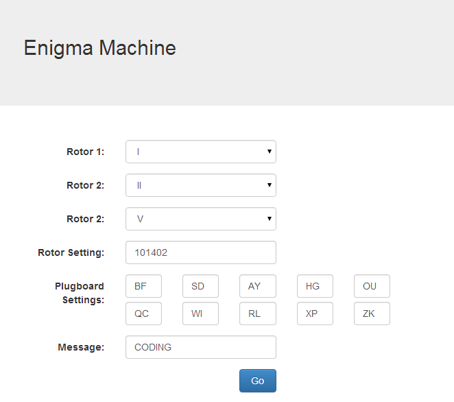
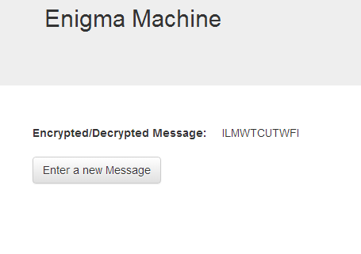

# enigma
a simulation of the enigma machine in php for Extended Project Qualification, 2013-14

A fun little project made to supplement my research into the history of Enigma, I ran this on a Raspberry Pi.
This was my first in-depth look into encryption, and really sparked my interest for the field of cyber-security.

I replicated the functionality of the enigma machine exactly - a quick breakdown of how it works:
    1. The sender sets up their machine using the daily settings (distributed monthly on paper)
    2. They then input each letter of the plaintext message 1 by 1 and record the result
    3. transmit the result
    4. The receiver uses the same daily settings, and inputs the encrypted message
    5. This returns the plaintext message

The inner workings of the machine are quite fascinating - an electromechanical method of encryption.

I wrote PHP functions to model each part of the machine seperately - e.g. one to pass letters through the plugboard, one for the first pass through the rotors, and another for the reflected pass through them.
The rotors also have to be carefully incremented - the third rotor rotates once for every 676 rotations of the first.

The UI:

Operator inputs daily settings and message here:

The message is then encryped letter by letter and displayed on the next page:

The decryption process is exactly the same as encrypting - using the same daily settings to "encrypt" the already-encrypted message will return the plaintext.

